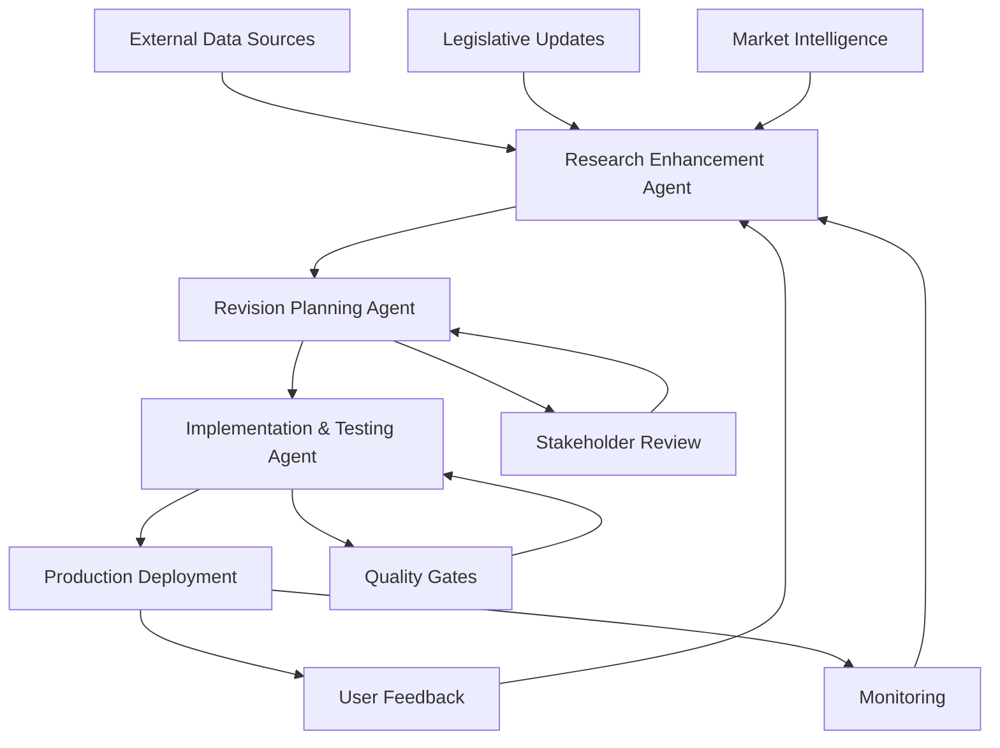
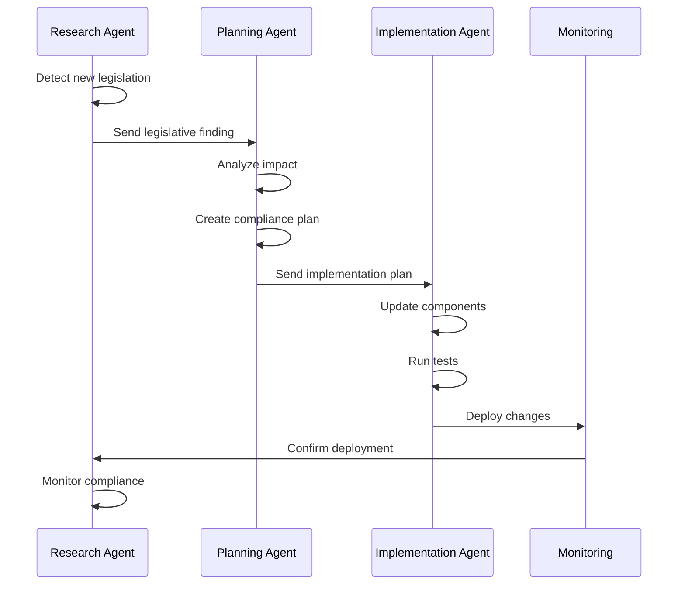
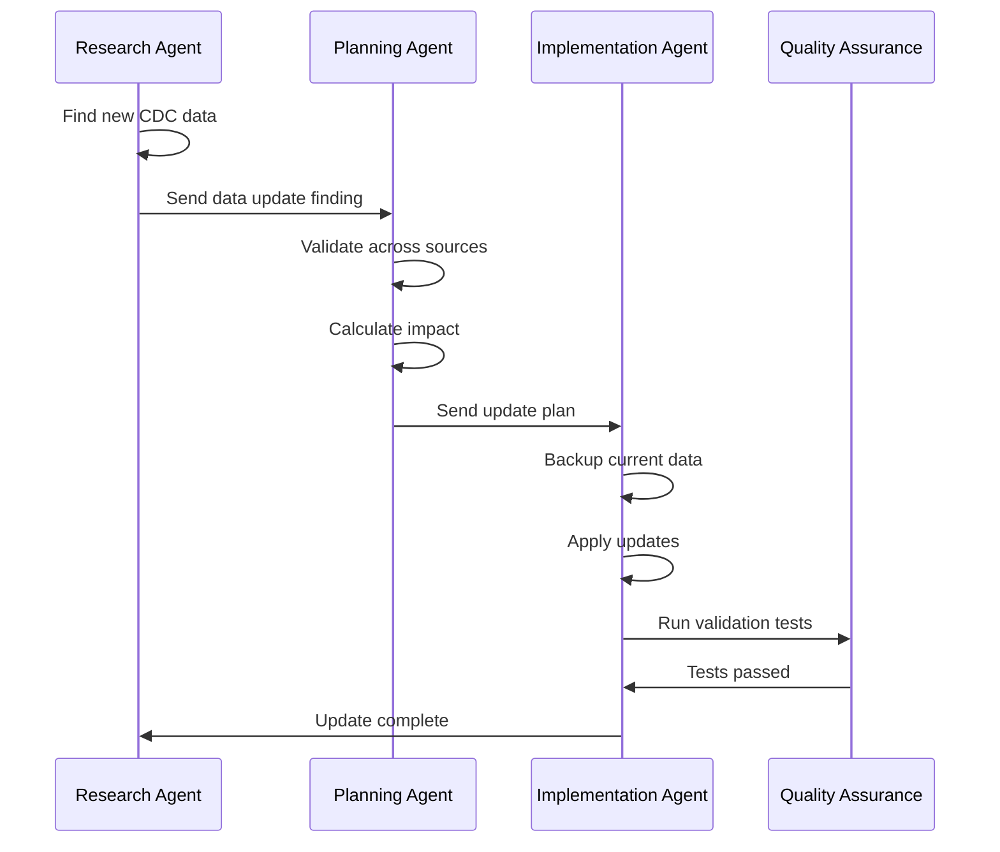
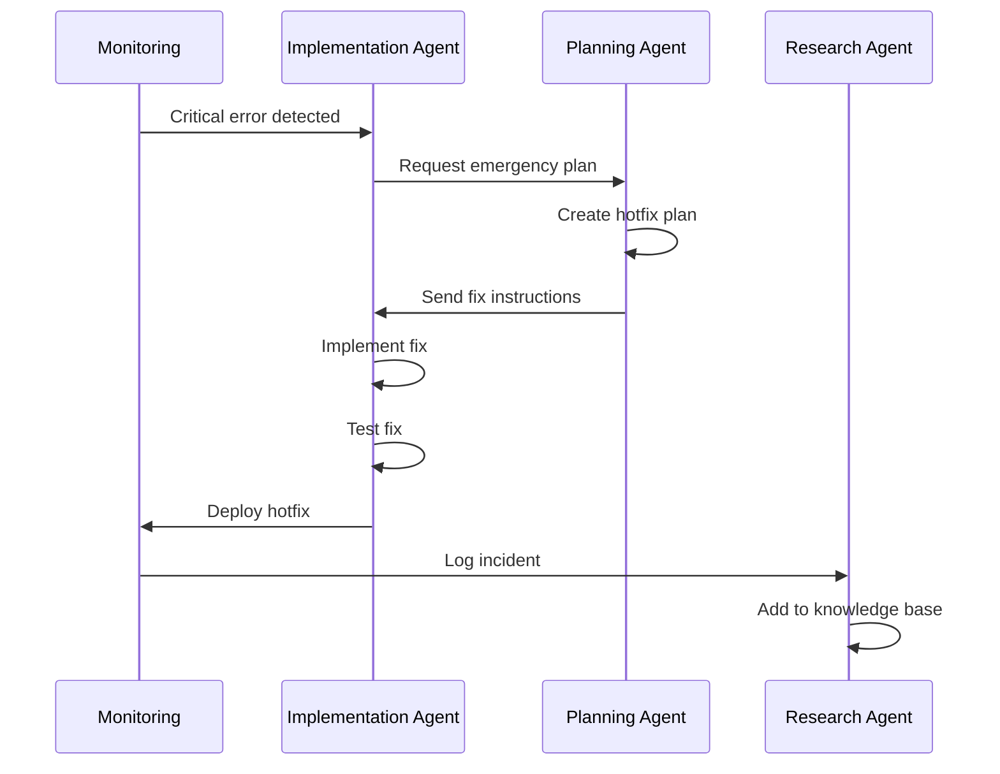

# Agent Integration Workflow

## System Architecture

The three-agent system works in a coordinated pipeline to continuously improve the Fertility Benefits Toolkit through research, planning, and implementation.



## Agent Communication Protocol

### Message Format
```typescript
interface AgentMessage {
  sender: 'research' | 'planning' | 'implementation';
  recipient: 'research' | 'planning' | 'implementation' | 'broadcast';
  timestamp: Date;
  message_type: 'finding' | 'plan' | 'status' | 'alert' | 'request';
  priority: 'critical' | 'high' | 'medium' | 'low';
  payload: any;
  correlation_id: string;
  requires_response: boolean;
}
```

### Communication Flow

#### 1. Research → Planning
```json
{
  "sender": "research",
  "recipient": "planning",
  "message_type": "finding",
  "priority": "high",
  "payload": {
    "finding_id": "F-2025-001",
    "category": "legislative",
    "title": "California SB-1234 Passed",
    "description": "New mandate requires egg freezing coverage",
    "effective_date": "2025-07-01",
    "impact": "Affects ROI calculations for CA employers",
    "recommended_actions": [
      "Update policy database",
      "Modify CA-specific calculations",
      "Add compliance notifications"
    ]
  }
}
```

#### 2. Planning → Implementation
```json
{
  "sender": "planning",
  "recipient": "implementation",
  "message_type": "plan",
  "priority": "high",
  "payload": {
    "plan_id": "P-2025-001",
    "title": "California Compliance Update",
    "phases": [
      {
        "phase": 1,
        "tasks": [
          {
            "id": "T001",
            "type": "data_update",
            "component": "PolicyTracker",
            "changes": ["Add SB-1234 to database"],
            "estimated_hours": 2
          }
        ]
      }
    ],
    "deadline": "2025-06-15"
  }
}
```

#### 3. Implementation → Research
```json
{
  "sender": "implementation",
  "recipient": "research",
  "message_type": "request",
  "priority": "medium",
  "payload": {
    "request_type": "validation",
    "component": "ROICalculator",
    "data_point": "ivf_success_rate",
    "current_value": 0.55,
    "reason": "Verify against latest CDC data"
  }
}
```

## Workflow Scenarios

### Scenario 1: Legislative Update Flow



### Scenario 2: Data Update Flow



### Scenario 3: Emergency Bug Fix



## Integration Points

### 1. Database Integration
```sql
-- Shared database schema for agent communication
CREATE TABLE agent_messages (
    id UUID PRIMARY KEY,
    sender VARCHAR(50),
    recipient VARCHAR(50),
    message_type VARCHAR(50),
    priority VARCHAR(20),
    payload JSONB,
    created_at TIMESTAMP DEFAULT NOW(),
    processed_at TIMESTAMP,
    status VARCHAR(20) DEFAULT 'pending'
);

CREATE TABLE agent_findings (
    id UUID PRIMARY KEY,
    agent_id VARCHAR(50),
    finding_type VARCHAR(50),
    data JSONB,
    confidence_score DECIMAL(3,2),
    created_at TIMESTAMP DEFAULT NOW(),
    plan_id UUID REFERENCES revision_plans(id)
);

CREATE TABLE revision_plans (
    id UUID PRIMARY KEY,
    finding_ids UUID[],
    plan_data JSONB,
    status VARCHAR(20),
    created_at TIMESTAMP DEFAULT NOW(),
    approved_at TIMESTAMP,
    implemented_at TIMESTAMP
);

CREATE TABLE implementation_logs (
    id UUID PRIMARY KEY,
    plan_id UUID REFERENCES revision_plans(id),
    component VARCHAR(100),
    change_type VARCHAR(50),
    before_value TEXT,
    after_value TEXT,
    executed_at TIMESTAMP DEFAULT NOW(),
    success BOOLEAN,
    error_message TEXT
);
```

### 2. API Integration
```typescript
// Agent API endpoints
class AgentAPI {
  // Research Agent endpoints
  async submitFinding(finding: Finding): Promise<string> {
    return await post('/api/agents/research/findings', finding);
  }
  
  async requestValidation(request: ValidationRequest): Promise<ValidationResult> {
    return await post('/api/agents/research/validate', request);
  }
  
  // Planning Agent endpoints
  async createPlan(findings: Finding[]): Promise<Plan> {
    return await post('/api/agents/planning/create', { findings });
  }
  
  async approvePlan(planId: string): Promise<void> {
    return await post(`/api/agents/planning/${planId}/approve`);
  }
  
  // Implementation Agent endpoints
  async executePlan(plan: Plan): Promise<ExecutionResult> {
    return await post('/api/agents/implementation/execute', plan);
  }
  
  async getStatus(executionId: string): Promise<ExecutionStatus> {
    return await get(`/api/agents/implementation/status/${executionId}`);
  }
}
```

### 3. Event Bus Integration
```typescript
// Event-driven communication between agents
class AgentEventBus {
  private subscribers: Map<string, Function[]> = new Map();
  
  subscribe(event: string, handler: Function) {
    if (!this.subscribers.has(event)) {
      this.subscribers.set(event, []);
    }
    this.subscribers.get(event)!.push(handler);
  }
  
  publish(event: string, data: any) {
    const handlers = this.subscribers.get(event) || [];
    handlers.forEach(handler => handler(data));
  }
}

// Usage
const eventBus = new AgentEventBus();

// Research Agent publishes findings
eventBus.publish('research.finding', {
  type: 'legislative',
  data: californiaUpdate
});

// Planning Agent subscribes to findings
eventBus.subscribe('research.finding', async (finding) => {
  const plan = await createRevisionPlan(finding);
  eventBus.publish('planning.plan_created', plan);
});

// Implementation Agent subscribes to plans
eventBus.subscribe('planning.plan_created', async (plan) => {
  const result = await executePlan(plan);
  eventBus.publish('implementation.complete', result);
});
```

## Coordination Mechanisms

### 1. Priority Queue System
```typescript
class PriorityQueue<T> {
  private items: Array<{item: T, priority: number}> = [];
  
  enqueue(item: T, priority: number) {
    this.items.push({item, priority});
    this.items.sort((a, b) => b.priority - a.priority);
  }
  
  dequeue(): T | undefined {
    return this.items.shift()?.item;
  }
}

// Agent task prioritization
const taskQueue = new PriorityQueue<AgentTask>();

taskQueue.enqueue(criticalLegislativeUpdate, 10);
taskQueue.enqueue(dataRefresh, 5);
taskQueue.enqueue(featureEnhancement, 2);
```

### 2. Conflict Resolution
```typescript
class ConflictResolver {
  resolve(conflicts: Conflict[]): Resolution {
    // Sort by priority and timestamp
    const sorted = conflicts.sort((a, b) => {
      if (a.priority !== b.priority) {
        return b.priority - a.priority;
      }
      return a.timestamp.getTime() - b.timestamp.getTime();
    });
    
    // Apply resolution strategies
    return this.applyStrategy(sorted[0]);
  }
  
  private applyStrategy(conflict: Conflict): Resolution {
    switch (conflict.type) {
      case 'data_inconsistency':
        return this.resolveDataConflict(conflict);
      case 'resource_contention':
        return this.resolveResourceConflict(conflict);
      case 'timing_conflict':
        return this.resolveTimingConflict(conflict);
      default:
        return this.defaultResolution(conflict);
    }
  }
}
```

### 3. State Management
```typescript
interface AgentSystemState {
  research: {
    status: 'idle' | 'scanning' | 'analyzing';
    last_scan: Date;
    pending_findings: number;
  };
  planning: {
    status: 'idle' | 'planning' | 'reviewing';
    active_plans: number;
    pending_approval: number;
  };
  implementation: {
    status: 'idle' | 'executing' | 'testing' | 'deploying';
    current_task: string | null;
    queue_length: number;
  };
}

class SystemStateManager {
  private state: AgentSystemState;
  
  updateState(agent: string, updates: Partial<AgentSystemState[keyof AgentSystemState]>) {
    this.state[agent] = { ...this.state[agent], ...updates };
    this.notifyObservers();
  }
  
  canProceed(agent: string): boolean {
    // Check dependencies and system readiness
    switch (agent) {
      case 'planning':
        return this.state.research.pending_findings > 0;
      case 'implementation':
        return this.state.planning.active_plans > 0 && 
               this.state.implementation.status === 'idle';
      default:
        return true;
    }
  }
}
```

## Monitoring and Observability

### 1. Agent Health Metrics
```typescript
interface AgentMetrics {
  agent_id: string;
  uptime: number;
  tasks_completed: number;
  tasks_failed: number;
  average_task_time: number;
  error_rate: number;
  last_activity: Date;
}

class MetricsCollector {
  collect(): AgentMetrics[] {
    return [
      this.getResearchMetrics(),
      this.getPlanningMetrics(),
      this.getImplementationMetrics()
    ];
  }
  
  alert(metric: string, value: number, threshold: number) {
    if (value > threshold) {
      this.sendAlert({
        metric,
        value,
        threshold,
        severity: this.calculateSeverity(value, threshold)
      });
    }
  }
}
```

### 2. System Dashboard
```typescript
interface DashboardData {
  system_health: 'healthy' | 'degraded' | 'critical';
  active_findings: number;
  plans_in_progress: number;
  deployments_today: number;
  error_rate_24h: number;
  upcoming_deadlines: Deadline[];
  recent_activities: Activity[];
}

class AgentDashboard {
  async getData(): Promise<DashboardData> {
    const [health, findings, plans, deployments, errors, deadlines, activities] = 
      await Promise.all([
        this.getSystemHealth(),
        this.getActiveFindingsCount(),
        this.getPlansInProgress(),
        this.getDeploymentCount('24h'),
        this.getErrorRate('24h'),
        this.getUpcomingDeadlines(),
        this.getRecentActivities()
      ]);
    
    return {
      system_health: health,
      active_findings: findings,
      plans_in_progress: plans,
      deployments_today: deployments,
      error_rate_24h: errors,
      upcoming_deadlines: deadlines,
      recent_activities: activities
    };
  }
}
```

## Failure Recovery

### 1. Circuit Breaker Pattern
```typescript
class CircuitBreaker {
  private failures = 0;
  private lastFailureTime: Date | null = null;
  private state: 'closed' | 'open' | 'half-open' = 'closed';
  
  async execute<T>(fn: () => Promise<T>): Promise<T> {
    if (this.state === 'open') {
      if (this.shouldAttemptReset()) {
        this.state = 'half-open';
      } else {
        throw new Error('Circuit breaker is open');
      }
    }
    
    try {
      const result = await fn();
      this.onSuccess();
      return result;
    } catch (error) {
      this.onFailure();
      throw error;
    }
  }
  
  private onSuccess() {
    this.failures = 0;
    this.state = 'closed';
  }
  
  private onFailure() {
    this.failures++;
    this.lastFailureTime = new Date();
    if (this.failures >= 5) {
      this.state = 'open';
    }
  }
}
```

### 2. Retry Strategy
```typescript
class RetryStrategy {
  async executeWithRetry<T>(
    fn: () => Promise<T>,
    maxRetries = 3,
    backoffMs = 1000
  ): Promise<T> {
    let lastError: Error;
    
    for (let i = 0; i < maxRetries; i++) {
      try {
        return await fn();
      } catch (error) {
        lastError = error as Error;
        await this.delay(backoffMs * Math.pow(2, i));
      }
    }
    
    throw lastError!;
  }
  
  private delay(ms: number): Promise<void> {
    return new Promise(resolve => setTimeout(resolve, ms));
  }
}
```

## Performance Optimization

### 1. Caching Strategy
```typescript
class AgentCache {
  private cache = new Map<string, CacheEntry>();
  
  set(key: string, value: any, ttl = 3600000) {
    this.cache.set(key, {
      value,
      expiry: Date.now() + ttl
    });
  }
  
  get(key: string): any | null {
    const entry = this.cache.get(key);
    if (!entry) return null;
    
    if (Date.now() > entry.expiry) {
      this.cache.delete(key);
      return null;
    }
    
    return entry.value;
  }
}
```

### 2. Batch Processing
```typescript
class BatchProcessor {
  private batch: any[] = [];
  private batchSize = 100;
  private flushInterval = 5000;
  
  add(item: any) {
    this.batch.push(item);
    if (this.batch.length >= this.batchSize) {
      this.flush();
    }
  }
  
  async flush() {
    if (this.batch.length === 0) return;
    
    const items = [...this.batch];
    this.batch = [];
    
    await this.processBatch(items);
  }
  
  private async processBatch(items: any[]) {
    // Process items in parallel with concurrency limit
    const concurrency = 10;
    const results = [];
    
    for (let i = 0; i < items.length; i += concurrency) {
      const batch = items.slice(i, i + concurrency);
      const batchResults = await Promise.all(
        batch.map(item => this.processItem(item))
      );
      results.push(...batchResults);
    }
    
    return results;
  }
}
```

## Security Considerations

### 1. Authentication Between Agents
```typescript
class AgentAuthenticator {
  private tokens = new Map<string, string>();
  
  generateToken(agentId: string): string {
    const token = crypto.randomBytes(32).toString('hex');
    this.tokens.set(agentId, token);
    return token;
  }
  
  validateToken(agentId: string, token: string): boolean {
    return this.tokens.get(agentId) === token;
  }
  
  rotateTokens() {
    for (const [agentId] of this.tokens) {
      this.generateToken(agentId);
    }
  }
}
```

### 2. Data Encryption
```typescript
class DataEncryption {
  encrypt(data: any): string {
    const cipher = crypto.createCipher('aes-256-cbc', process.env.ENCRYPTION_KEY!);
    let encrypted = cipher.update(JSON.stringify(data), 'utf8', 'hex');
    encrypted += cipher.final('hex');
    return encrypted;
  }
  
  decrypt(encrypted: string): any {
    const decipher = crypto.createDecipher('aes-256-cbc', process.env.ENCRYPTION_KEY!);
    let decrypted = decipher.update(encrypted, 'hex', 'utf8');
    decrypted += decipher.final('utf8');
    return JSON.parse(decrypted);
  }
}
```

---

*Integration Workflow Version: 1.0*
*Last Updated: January 2025*
*Author: Haotian Bai*