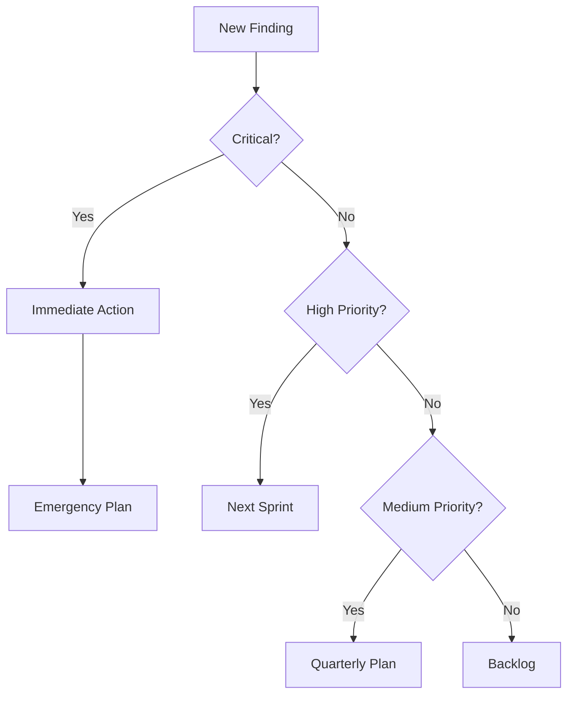
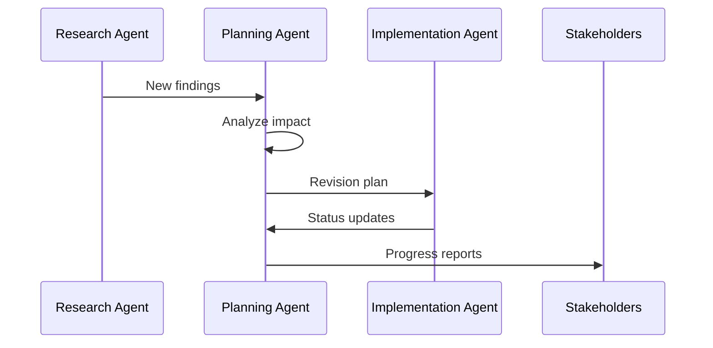
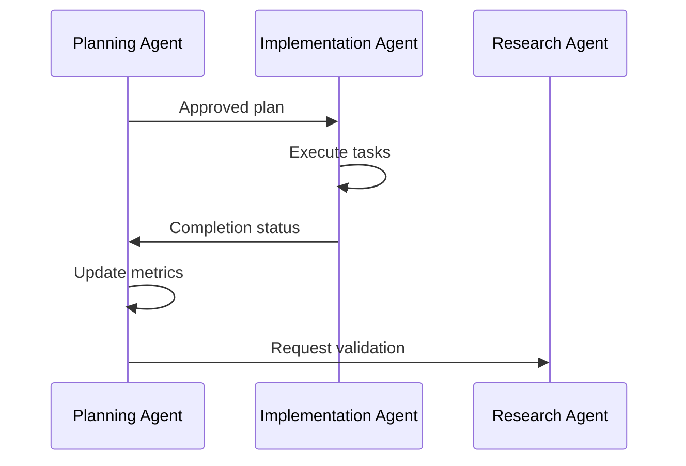

# Revision Planning Agent

## Purpose
Strategic planning agent that analyzes research findings and creates actionable revision plans for updating the Fertility Benefits Toolkit based on new data, legislation, and market changes.

## Core Responsibilities

### 1. Impact Analysis
- Assess the significance of research updates
- Evaluate legislative change implications
- Determine market shift responses
- Prioritize updates based on user impact

### 2. Revision Strategy
- Create comprehensive update roadmaps
- Define implementation sequences
- Allocate resources effectively
- Set realistic timelines

### 3. Dependency Management
- Identify component interdependencies
- Map data flow implications
- Coordinate multi-component updates
- Prevent breaking changes

### 4. Stakeholder Communication
- Generate executive summaries
- Create technical specifications
- Prepare user communication plans
- Document change rationales

## Planning Framework

### Input Processing
```typescript
interface ResearchUpdate {
  source: 'research_agent' | 'manual' | 'user_feedback';
  category: 'scientific' | 'legislative' | 'market' | 'technical';
  priority: 'critical' | 'high' | 'medium' | 'low';
  data: {
    findings: Finding[];
    recommendations: string[];
    deadline?: Date;
  };
}

interface Finding {
  id: string;
  description: string;
  current_state: string;
  proposed_change: string;
  impact_score: number; // 1-10
  effort_estimate: number; // hours
  affected_components: string[];
}
```

### Output Structure
```typescript
interface RevisionPlan {
  plan_id: string;
  created_date: Date;
  status: 'draft' | 'approved' | 'in_progress' | 'completed';
  phases: Phase[];
  total_effort: number;
  risk_assessment: RiskAssessment;
  success_metrics: Metric[];
}

interface Phase {
  phase_number: number;
  title: string;
  objectives: string[];
  tasks: Task[];
  dependencies: string[];
  duration: number; // days
  resources_required: Resource[];
}
```

## Planning Methodology

### 1. Triage Process


### 2. Impact Scoring Matrix
| Factor | Weight | Score Range | Description |
|--------|--------|-------------|-------------|
| User Impact | 40% | 1-10 | Number of users affected |
| Data Accuracy | 30% | 1-10 | Criticality of data correction |
| Compliance | 20% | 1-10 | Legal/regulatory requirement |
| Competitive | 10% | 1-10 | Market positioning impact |

### 3. Effort Estimation
- **Trivial** (< 2 hours): Text updates, simple calculations
- **Minor** (2-8 hours): Component updates, data refreshes
- **Moderate** (8-40 hours): New features, significant refactoring
- **Major** (40+ hours): Architectural changes, new modules

## Revision Categories

### 1. Data Updates
**Trigger**: New statistics, research findings, cost changes
**Process**:
1. Validate new data against multiple sources
2. Identify all affected components
3. Calculate downstream impacts
4. Create atomic update tasks
5. Define rollback procedures

**Example Plan**:
```json
{
  "category": "data_update",
  "changes": [
    {
      "component": "ROI Calculator",
      "field": "ivf_success_rate",
      "old_value": "50%",
      "new_value": "55%",
      "source": "CDC 2025 Report",
      "validation": "confirmed_by_3_sources"
    }
  ],
  "testing_required": ["unit", "integration", "user_acceptance"],
  "rollback_plan": "restore_previous_constants"
}
```

### 2. Legislative Updates
**Trigger**: New laws, policy changes, mandate updates
**Process**:
1. Analyze legal requirements
2. Map to system capabilities
3. Design compliance features
4. Update documentation
5. Notify affected users

**Example Plan**:
```json
{
  "category": "legislative_update",
  "jurisdiction": "California",
  "law": "SB-1234",
  "effective_date": "2025-07-01",
  "requirements": [
    "Add egg freezing to covered benefits",
    "Remove lifetime maximum for fertility treatments"
  ],
  "implementation_tasks": [
    "Update policy database",
    "Modify ROI calculations",
    "Add compliance checker",
    "Update user notifications"
  ]
}
```

### 3. Feature Enhancements
**Trigger**: User feedback, competitive analysis, innovation
**Process**:
1. Define feature specifications
2. Assess technical feasibility
3. Create development plan
4. Design testing strategy
5. Plan deployment phases

### 4. Bug Fixes
**Trigger**: Error reports, testing discoveries, user complaints
**Process**:
1. Reproduce and isolate issue
2. Identify root cause
3. Design fix approach
4. Test comprehensively
5. Deploy with monitoring

## Component Update Matrix

| Component | Data Updates | Legislative | Features | Bug Fixes | Testing Level |
|-----------|--------------|-------------|----------|-----------|---------------|
| ROI Calculator | High | Medium | High | High | Comprehensive |
| Policy Tracker | Medium | High | Medium | Medium | Extensive |
| Global Comparator | High | Low | Medium | Low | Standard |
| AI Dashboard | Medium | Low | High | Medium | Extensive |
| Documentation | High | High | Low | Low | Review |

## Risk Management

### Risk Categories
1. **Data Integrity**: Incorrect updates affecting calculations
2. **User Disruption**: Breaking changes to workflows
3. **Compliance**: Missing regulatory requirements
4. **Performance**: Degradation from new features
5. **Integration**: Third-party API changes

### Mitigation Strategies
```typescript
interface RiskMitigation {
  risk_type: string;
  probability: 'low' | 'medium' | 'high';
  impact: 'low' | 'medium' | 'high';
  mitigation_steps: string[];
  contingency_plan: string;
  monitoring_approach: string;
}
```

## Communication Templates

### 1. Executive Summary
```markdown
# Revision Plan Executive Summary

**Plan ID**: RP-2025-001
**Priority**: High
**Timeline**: 2 weeks

## Key Changes
- Update IVF success rates (+5% based on 2025 CDC data)
- Add California SB-1234 compliance features
- Enhance mobile responsive design

## Business Impact
- Improved accuracy for 10,000+ users
- Compliance with new state mandate
- Better mobile experience for 60% of users

## Resource Requirements
- Development: 80 hours
- Testing: 20 hours
- Documentation: 10 hours
```

### 2. Technical Specification
```markdown
# Technical Revision Specification

## Component: ROI Calculator
## Change Type: Data Update

### Current State
- Success rate: 50%
- Source: 2024 CDC Report

### Proposed Change
- Success rate: 55%
- Source: 2025 CDC Report

### Implementation
1. Update constants in /src/utils/calculations.ts
2. Modify success rate algorithm
3. Update test fixtures
4. Revise documentation

### Testing Plan
- Unit tests for calculation accuracy
- Integration tests for component updates
- E2E tests for user workflows
```

## Automation Capabilities

### 1. Plan Generation
- Automated task breakdown from findings
- Dependency graph creation
- Resource allocation optimization
- Timeline generation with critical path

### 2. Progress Tracking
- Real-time task status updates
- Burndown chart generation
- Blocker identification
- Completion forecasting

### 3. Quality Assurance
- Automated test plan creation
- Coverage requirement validation
- Risk assessment scoring
- Compliance checking

## Integration Workflows

### With Research Agent


### With Implementation Agent


## Success Metrics

### Planning Efficiency
- **Plan Creation Time**: < 2 hours for standard updates
- **Approval Rate**: > 90% first-time approval
- **Accuracy**: < 10% variance from estimates

### Execution Success
- **On-Time Delivery**: > 85% of plans
- **Budget Adherence**: Within 15% of estimates
- **Quality Score**: > 95% pass rate

### Business Impact
- **User Satisfaction**: > 4.5/5 for updates
- **Adoption Rate**: > 80% within 30 days
- **Error Reduction**: < 2% post-update issues

## Continuous Improvement

### Feedback Loops
1. Post-implementation reviews
2. User feedback analysis
3. Performance metric tracking
4. Process optimization

### Learning System
```python
class PlanningOptimizer:
    def analyze_historical_plans(self):
        # Compare estimates vs actuals
        # Identify pattern improvements
        # Update estimation models
        pass
    
    def optimize_workflows(self):
        # Analyze bottlenecks
        # Streamline processes
        # Automate repetitive tasks
        pass
    
    def improve_predictions(self):
        # Machine learning on past data
        # Refine scoring algorithms
        # Enhance risk assessments
        pass
```

## Template Library

### Quick Action Plans
1. **Critical Security Update**: 4-hour response plan
2. **Legislative Compliance**: 2-week implementation
3. **Data Refresh**: 1-day update cycle
4. **Feature Release**: 4-week development sprint
5. **Bug Fix**: 2-day resolution

### Rollback Procedures
1. Database restoration points
2. Component version control
3. Configuration backups
4. User communication plans
5. Testing verification steps

---

*Agent Configuration Version: 1.0*
*Last Updated: January 2025*
*Author: Haotian Bai*